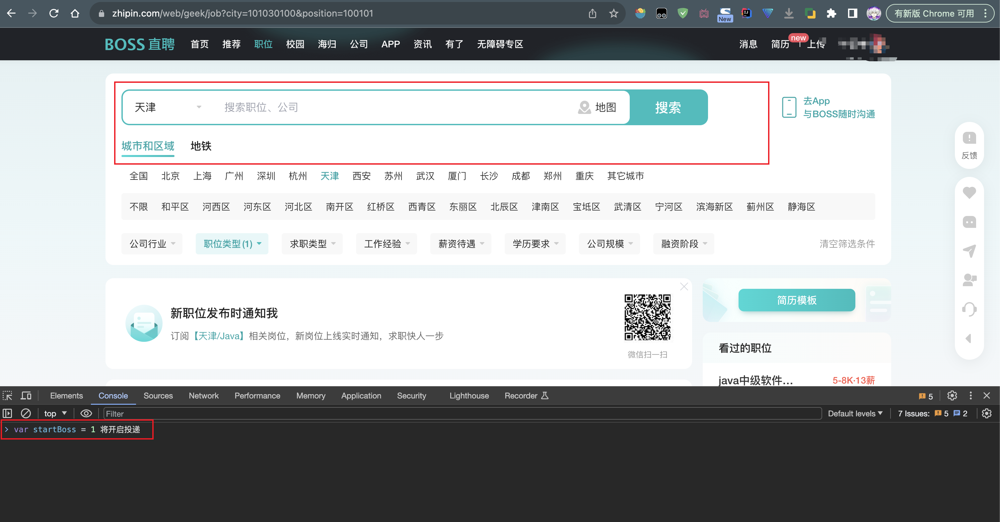

# BossSeaDumping

此项目基于selenium 利用谷歌浏览器进行对boss首页岗位的投递

## 环境要素

谷歌浏览器 ，jdk20以上

## 运行

bin目录下有可执行文件运行即可
刚开始运行需要等待时间，长时间不开启可以尝试重复运行

待浏览器开启后进入首页手动筛选好条件后进入F12 
如图 


```text
var startBoss = 1 将开启投递
var startBoss = 0 将关闭投递
```
通过设置变量进行开启/关闭操作
最后祝愿大家可以找到心仪的工作

------

boss每日上线为100 预计8分钟完毕。期间页面可能会多次刷新这是boss反检测结果等待之后即可

